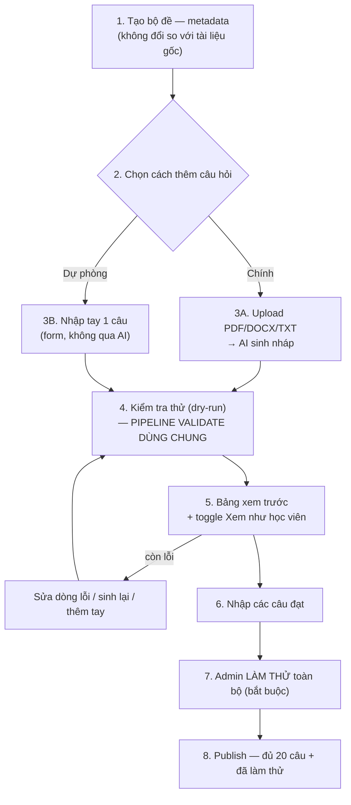

# Bộ đề câu hỏi — Luồng AI-only (thay thế nhập CSV)

**Trạng thái:** 🟢 **ĐÃ CHỐT — làm ngay, thay thế phần nhập CSV.** (28/07/2026)

**Dành cho:** đưa thẳng cho AI coding agent (Claude Code / Antigravity) để implement. Tài liệu này **tự chứa đủ để bắt đầu code** — chỉ tham chiếu sang tài liệu khác cho phần không đổi.

**Thay thế:** mục 4 (bước 2-5), mục 5 (format CSV), mục 6 (quy tắc kiểm tra), phần "Tạo câu mới bằng form ❌" ở mục 7, và các endpoint import CSV ở mục 12 của [`question-set-design.md`](question-set-design.md).

**Giữ nguyên, không đổi** (đọc ở tài liệu gốc khi cần): data model `QuestionSet`/`TestAttempt`/`TestAnswer`/`VocabTopic`, cửa publish (2 điều kiện), phía người học (mục 10-11), giới hạn 3 bộ/ngày, lưu tất cả lượt làm bài. Và từ [`question-set-ai-generation-addendum.md`](question-set-ai-generation-addendum.md): prompt sinh câu hỏi (mục 3.3), toggle "Xem như học viên" (mục 4), business rules BR-48→BR-53.

---

## 1. Vì sao đổi, và cái giá phải trả

**Quyết định:** bỏ hẳn việc nhập CSV. Chỉ còn **một luồng chính** (AI sinh từ file) + **một luồng dự phòng** (nhập tay từng câu).

Ba hệ quả cần biết trước khi code, đã thống nhất với người yêu cầu:

1. **AI trở thành điểm nghẽn duy nhất cho việc tạo hàng loạt.** Không còn CSV làm phương án B khi AI lỗi/hết quota. Vì vậy bắt buộc phải có form nhập tay 1 câu (mục 5) — đây là đảo ngược quyết định trước đó ("không làm form tạo câu mới" vì "không ai nhập 480 câu bằng form"). Giờ form đó không dùng để nhập hàng loạt, mà để **cứu hộ** khi AI không dùng được.
2. **Hỗ trợ 3 định dạng: PDF, DOCX, TXT** — chỉ định dạng có chữ sẵn, **không OCR ảnh scan** ở bản này.
3. **Toàn bộ output của AI (dù nguồn file gì) đổ vào đúng MỘT pipeline kiểm tra** đã thiết kế cho CSV trước đây — tái dùng nguyên vẹn, không viết hai lần.

## 2. Luồng đầy đủ



**Điểm kiến trúc quan trọng nhất:** bước 4 trở đi (kiểm tra thử, bảng xem trước, nhập câu, làm thử, publish) là **một pipeline duy nhất**, không quan tâm câu hỏi tới từ AI hay nhập tay. Component/API viết ở đây dùng chung cho cả hai nguồn.

## 3. Trích xuất file — PDF / DOCX / TXT

### 3.1. Thư viện

| Định dạng | Thư viện Node đề xuất | Ghi chú |
|---|---|---|
| PDF | `pdf-parse` | Chỉ đọc được PDF có text thật, không đọc được ảnh scan |
| DOCX | `mammoth` | Trích xuất text thô, bỏ qua định dạng phức tạp |
| TXT | đọc thẳng bằng `fs`/buffer, decode UTF-8 | Cần xử lý trường hợp file không phải UTF-8 |

### 3.2. Service dùng chung

```ts
// backend/src/modules/question-sets/file-extractor.service.ts
export type SupportedFileType = 'pdf' | 'docx' | 'txt';

export interface ExtractResult {
  text: string;
  charCount: number;
  truncated: boolean;
}

const MAX_CHARS = 8000; // giới hạn an toàn trước khi đưa vào prompt AI

@Injectable()
export class FileExtractorService {
  async extract(file: Buffer, mimeType: string): Promise<ExtractResult> {
    const type = this.detectType(mimeType);
    let raw: string;

    switch (type) {
      case 'pdf':
        raw = (await pdfParse(file)).text;
        break;
      case 'docx':
        raw = (await mammoth.extractRawText({ buffer: file })).value;
        break;
      case 'txt':
        raw = file.toString('utf-8');
        break;
    }

    const cleaned = raw.replace(/\s+/g, ' ').trim();
    if (cleaned.length < 200) {
      throw new BadRequestException(
        'Không đọc được đủ nội dung văn bản từ file này. File có thể là ảnh scan — ' +
        'chỉ hỗ trợ PDF/DOCX/TXT có chữ (copy được), chưa hỗ trợ ảnh scan.',
      );
    }

    const truncated = cleaned.length > MAX_CHARS;
    return { text: cleaned.slice(0, MAX_CHARS), charCount: cleaned.length, truncated };
  }

  private detectType(mimeType: string): SupportedFileType {
    if (mimeType === 'application/pdf') return 'pdf';
    if (mimeType.includes('wordprocessingml')) return 'docx';
    if (mimeType === 'text/plain') return 'txt';
    throw new BadRequestException('Chỉ hỗ trợ file PDF, DOCX hoặc TXT.');
  }
}
```

**Thông báo lỗi phải cụ thể** (như trong code trên) — "file không hợp lệ" chung chung sẽ khiến Admin không biết sửa gì.

## 4. Sinh câu hỏi bằng AI

Endpoint và luồng gọi AI giữ nguyên như [`question-set-ai-generation-addendum.md`](question-set-ai-generation-addendum.md) mục 2 (prompt có tiêu chí chất lượng nhiễu/độ khó). **Nhà cung cấp đã đổi sang Google Gemini — xem mục 2b của addendum về lý do; prompt không đổi.** Chỉ khác đầu vào: thay vì chỉ nhận PDF, giờ nhận kết quả từ `FileExtractorService` (dùng chung cho cả 3 định dạng) — **prompt và cấu trúc JSON trả về không đổi**.

```
POST /admin/question-sets/:id/generate
Body: multipart/form-data { file, questionCount?, types?, note? }

1. FileExtractorService.extract(file) → text
2. Gọi AI với text + metadata bộ đề (ngôn ngữ/chủ đề/trình độ có sẵn từ QuestionSet)
3. Parse JSON → đổ vào pipeline dry-run (mục 6 tài liệu gốc, không đổi)
4. Trả về APIResponse<DryRunResult> — CÙNG SHAPE như trước đây trả cho CSV
```

**Vì response cùng shape với luồng CSV cũ, FE không cần phân biệt nguồn khi hiển thị bảng xem trước** — chỉ khác cái gọi API nào để tạo ra `DryRunResult`.

## 5. Form nhập tay 1 câu — dự phòng khi AI không dùng được

### 5.1. Vì sao cần, dùng khi nào

- AI service lỗi, hết quota, hoặc trả về chất lượng quá kém sau nhiều lần thử
- Bổ sung 1-2 câu lẻ để đủ 20 (thay vì sinh lại cả lô qua AI cho 1-2 câu thiếu)
- Sửa nhanh một câu bị AI hiểu sai hoàn toàn (nhanh hơn là sửa qua prompt)

### 5.2. Form

Nút **"✏️ Thêm câu thủ công"** đặt cạnh nút "✨ Sinh từ tài liệu" ở bước 2.

| Trường | Kiểu |
|---|---|
| Loại câu | select: vocabulary / grammar / cloze / reading |
| Từ vựng gốc (`term`) | text — chỉ hiện khi loại = vocabulary |
| Đoạn văn (`passage`) | textarea — chỉ hiện khi loại = cloze/reading |
| Câu hỏi (`prompt`) | textarea |
| 4 đáp án | 4 ô text |
| Đáp án đúng | radio chọn 1 trong 4 ô trên |
| Giải thích | textarea, không bắt buộc |

Bấm "Thêm vào bộ" → câu này **đi qua đúng hàm validate** (không có ngoại lệ — kiểm tra trùng đáp án, trùng câu hỏi trong bộ...) → nếu hợp lệ thì thêm thẳng vào danh sách câu đã có (không cần qua bước "xem trước" vì đã nhập chính xác từng trường, không có rủi ro sai định dạng như parse file).

### 5.3. Đây KHÔNG phải để nhập hàng loạt

Không làm nút "Thêm và nhập câu tiếp" lặp lại nhanh — cố tình để việc nhập tay hơi chậm một chút, vì mục đích là **cứu hộ từng câu**, không phải thay thế AI. Nếu Admin thấy mình đang nhập tay quá 5 câu liên tục, đó là dấu hiệu AI đang có vấn đề cần báo cáo, không phải dùng form này bù đắp mãi.

## 6. Data model — cập nhật

Dựa trên schema gốc ở `question-set-design.md` mục 3.2, chỉ thêm:

```prisma
model TestQuestion {
  // ...các trường đã có (id, setId, orderIndex, type, term, passage, prompt,
  //    options, answerIndex, explanation, status, createdAt)...

  source     QuestionSource @default(manual)
  sourceMeta Json?          // { fileName, fileType, model, generatedAt } — chỉ khi source=ai_generated

  @@map("test_questions")
}

enum QuestionSource { manual  ai_generated }
```

**Bỏ giá trị `csv_import`** khỏi enum so với bản đề xuất trong addendum, vì luồng CSV không còn tồn tại.

## 7. API — danh sách đầy đủ (thay thế mục 12 tài liệu gốc)

**Admin:**

| Method | Đường dẫn | Việc | Thay đổi |
|---|---|---|---|
| GET | `/admin/question-sets` | Danh sách + lọc | Không đổi |
| POST | `/admin/question-sets` | Tạo bộ (metadata) | Không đổi |
| PATCH | `/admin/question-sets/:id` | Sửa metadata | Không đổi |
| **POST** | **`/admin/question-sets/:id/generate`** | **Upload file → AI sinh → dry-run** | **Thay cho `/import?dryRun=true`** |
| **POST** | **`/admin/question-sets/:id/questions`** | **Thêm 1 câu thủ công (mục 5)** | **Mới** |
| GET | `/admin/question-sets/:id/questions` | Danh sách câu trong bộ | Không đổi |
| PATCH | `/admin/questions/:id` | Sửa 1 câu | Không đổi |
| DELETE | `/admin/questions/:id` | Xoá/retire | Không đổi |
| POST | `/admin/question-sets/:id/attempt` | Admin làm thử | Không đổi |
| POST | `/admin/question-sets/:id/publish` | Publish | Không đổi |
| POST | `/admin/question-sets/:id/unpublish` | Unpublish | Không đổi |
| GET/POST | `/admin/vocab-topics` | Quản lý chủ đề | Không đổi |
| ~~POST~~ | ~~`/admin/question-sets/:id/import`~~ | ~~Nhập CSV~~ | **Xoá** |
| ~~GET~~ | ~~`/admin/question-sets/template`~~ | ~~Tải CSV mẫu~~ | **Xoá** |

**Người học:** không đổi — xem mục 12 tài liệu gốc.

## 8. Business rules — hợp nhất

Kế thừa BR-38, BR-40 → BR-47 (data integrity, publish gate) từ tài liệu gốc và BR-48, BR-50 → BR-53 từ addendum. **Bỏ BR-39 cũ** (nếu viết riêng cho "nhập CSV") — thay bằng:

| Mã | Quy tắc |
|---|---|
| BR-54 | Chỉ hỗ trợ file PDF/DOCX/TXT có văn bản trích xuất được; không OCR ảnh scan |
| BR-55 | Câu hỏi dù nguồn AI hay nhập tay đều **phải qua cùng bộ validate** — không có đường tắt theo nguồn |
| BR-56 | Form nhập tay không giới hạn số lần dùng, nhưng không có chế độ nhập nhanh liên tục — đây là lối cứu hộ, không phải kênh chính |
| BR-57 | Mọi câu hỏi lưu `source`; câu `ai_generated` lưu thêm `sourceMeta` để truy vết theo file gốc |

*(Giữ nguyên BR-48/BR-50/BR-51/BR-52/BR-53 từ addendum — đọc tại đó, không lặp lại ở đây.)*

## 9. Việc cần làm — thứ tự

| # | Việc | Phía | Phụ thuộc |
|---|---|---|---|
| 1 | Schema: thêm `source`, `sourceMeta`, enum `QuestionSource` | BE | — |
| 2 | `FileExtractorService` (PDF/DOCX/TXT) | BE | 1 |
| 3 | Tích hợp gọi AI, đổ kết quả vào pipeline validate/dry-run (tái dùng hàm đã viết cho CSV nếu đã có, hoặc viết mới nếu CSV chưa triển khai) | BE | 2 |
| 4 | Endpoint `POST /admin/question-sets/:id/questions` (thêm 1 câu thủ công) | BE | 1 |
| 5 | **Xoá** endpoint/route liên quan CSV nếu đã lỡ code trước đó | BE | — |
| 6 | Form upload file (PDF/DOCX/TXT) + tuỳ chọn số câu/loại/ghi chú | FE | 3 |
| 7 | Form nhập tay 1 câu (mục 5) | FE | 4 |
| 8 | Bảng xem trước + toggle "Xem như học viên" (tái dùng thiết kế addendum mục 4) | FE | 3 |
| 9 | Admin làm thử + Publish (không đổi so với tài liệu gốc, giữ nguyên nếu đã có) | BE+FE | — |
| 10 | Soạn nội dung: chuẩn bị vài file PDF/DOCX mẫu cho mỗi (ngôn ngữ × chủ đề × trình độ) để chạy AI sinh | BA | 3, 6 |

**Nếu phần CSV ở `question-set-design.md` chưa hề được code** (chỉ mới là thiết kế), bước 5 không cần làm — bỏ qua.

## 10. Test — trọng tâm mới

Ngoài checklist đã có ở tài liệu gốc (mục 14) và addendum (mục 7), thêm:

- [ ] Upload file **DOCX** hợp lệ → sinh câu hỏi đúng như luồng PDF
- [ ] Upload file **TXT** hợp lệ → sinh câu hỏi đúng
- [ ] Upload ảnh scan giả làm PDF (PDF chứa ảnh, không có text) → báo lỗi rõ, không sinh câu rỗng
- [ ] Upload file định dạng khác (vd .xlsx) → bị từ chối với thông báo rõ "chỉ hỗ trợ PDF/DOCX/TXT"
- [ ] **AI generate lỗi/timeout** → Admin vẫn thêm được câu qua form nhập tay để hoàn thành bộ
- [ ] Câu nhập tay bị trùng với câu đã có trong bộ → bị chặn bởi cùng validate như AI
- [ ] Bộ đề hoàn toàn từ form nhập tay (không dùng AI) vẫn publish được bình thường
- [ ] Trường `source` và `sourceMeta` lưu đúng theo từng nguồn

## 11. Việc cần chốt — **đã chốt 04/08/2026**

1. ~~Giới hạn kích thước file upload~~ → **5MB** (`MAX_FILE_BYTES` trong `file-extractor.service.ts`, áp cả ở `FileInterceptor` lẫn trong service). Vượt ngưỡng báo lỗi kèm số MB thực tế.
2. ~~Giới hạn số lần gọi AI generate/ngày~~ → **không giới hạn theo ngày**, chỉ giữ BR-52 (1 lần/bộ đề/phút, lưu ở `QuestionSet.lastGeneratedAt`). Đủ để chặn bấm nhầm; nếu chi phí AI thành vấn đề thật thì mới thêm hạn mức ngày.
3. ~~Tự động gợi ý nhập tay khi AI sinh thiếu~~ → **hiển thị số chỗ còn trống** ("còn N chỗ") ngay cạnh bảng xem trước, nút "Thêm câu thủ công" luôn hiện — Admin tự quyết, hệ thống không tự mở form.

## 12. Tài liệu liên quan

- [`question-set-design.md`](question-set-design.md) — data model gốc, cửa publish, phía người học **(phần CSV trong này đã bị thay thế bởi tài liệu này)**
- [`question-set-ai-generation-addendum.md`](question-set-ai-generation-addendum.md) — prompt AI, toggle xem trước, business rules BR-48→BR-53 **(đã chuyển từ backlog sang chính thức)**
