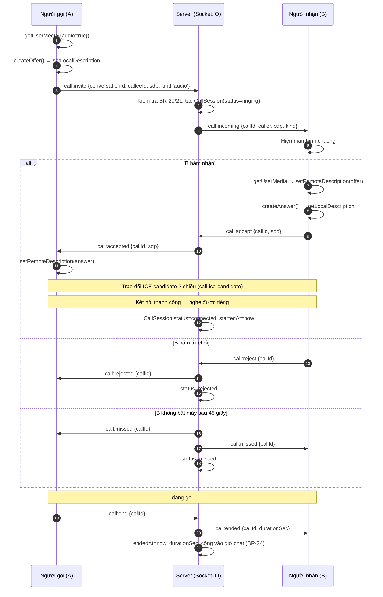
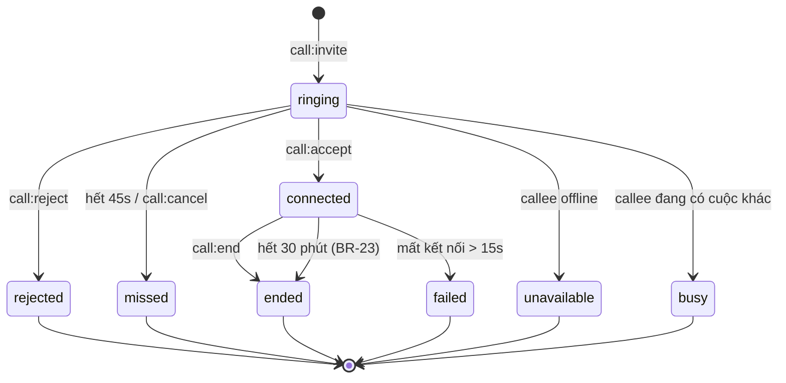

# Thiết kế triển khai — Gọi thoại (Audio Call)

**Người lập:** Vinh (BA) · **Ngày:** 26/07/2026 · **Trạng thái:** Sẵn sàng để implement

**Phạm vi:** audio-only ở giai đoạn này. Kiến trúc thiết kế sẵn để bật video sau mà **không phải viết lại signaling** — xem mục 8.

**Dành cho:** BE Dev (signaling + CallSession) và FE Dev (WebRTC client + UI).

---

## 1. Hạ tầng đã có sẵn — tận dụng, đừng làm lại

Đọc `backend/src/modules/chat/chat.gateway.ts` và `frontend/src/lib/socket.ts` cho thấy phần khó của signaling **đã xong từ trước**:

| Thứ cần cho signaling | Đã có | Ở đâu |
|---|---|---|
| Socket.IO server + client | ✅ | `ChatGateway` · `lib/socket.ts` |
| Xác thực JWT khi bắt tay socket | ✅ | `handleConnection` verify `handshake.auth.token` |
| Room riêng theo từng user (để đổ chuông) | ✅ | `client.join('user:' + userId)` |
| Kiểm tra 2 người có cùng hội thoại không | ✅ | `chatService.assertParticipant()` — dùng cho BR-20 |
| Tự reconnect | ✅ | `reconnection: true` ở client |

**Nghĩa là:** không cần dựng signaling server riêng, không cần thư viện ngoài. Chỉ cần **thêm event mới** vào kết nối socket đang chạy.

> ⚠️ **Bẫy khi tạo `CallGateway` riêng:** trong NestJS, nếu hai `@WebSocketGateway` cùng chạy trên namespace mặc định thì `handleConnection` sẽ chạy **ở cả hai** → JWT bị verify hai lần. Cách xử lý: tách phần verify JWT ra một helper dùng chung, hoặc đơn giản là **đặt event gọi thoại ngay trong `ChatGateway`**. Với sprint 5 ngày, khuyến nghị phương án thứ hai.

## 2. WebRTC hoạt động thế nào (phần cần hiểu trước khi code)

Ba thành phần, đừng nhầm vai trò:

| Thành phần | Làm gì | Có sẵn chưa |
|---|---|---|
| **Signaling** | Chuyển hộ "lời mời" và "thông tin kết nối" giữa 2 máy. **Không** truyền âm thanh | ✅ Socket.IO |
| **STUN** | Giúp máy biết địa chỉ IP công khai của chính nó | ✅ Google, miễn phí |
| **TURN** | Trung chuyển âm thanh khi 2 máy không nối thẳng được | ⚠️ Open Relay, cần đăng ký |

Điểm dễ hiểu nhầm: **âm thanh KHÔNG đi qua server của mình.** Socket.IO chỉ dùng lúc bắt tay; sau khi kết nối xong, tiếng nói đi thẳng máy-tới-máy (hoặc qua TURN nếu bí). Vì thế server Stududu không tốn băng thông cho cuộc gọi.

## 3. Luồng cuộc gọi



## 4. Bảng socket event

Đặt tên theo tiền tố `call:`. Event **client → server** và **server → client** dùng tên khác nhau (thể chủ động / bị động) để đọc log không lẫn.

### Client → Server

| Event | Payload | Server làm gì |
|---|---|---|
| `call:invite` | `{ conversationId, calleeId, sdp, kind }` | Kiểm tra BR-20/21, tạo `CallSession(ringing)`, đẩy `call:incoming` vào room `user:{calleeId}` |
| `call:accept` | `{ callId, sdp }` | Cập nhật `connected`, `startedAt`, chuyển answer cho người gọi |
| `call:reject` | `{ callId }` | `status=rejected`, báo người gọi |
| `call:cancel` | `{ callId }` | Người gọi tự huỷ trước khi B bắt máy → `status=missed` |
| `call:ice-candidate` | `{ callId, candidate }` | Chuyển tiếp cho phía bên kia (server không xử lý nội dung) |
| `call:end` | `{ callId }` | Tính `durationSec`, `status=ended`, báo phía kia |

### Server → Client

| Event | Payload | Client làm gì |
|---|---|---|
| `call:incoming` | `{ callId, caller: {id, displayName, avatarUrl}, sdp, kind }` | Hiện màn hình chuông |
| `call:accepted` | `{ callId, sdp }` | `setRemoteDescription(answer)` |
| `call:rejected` | `{ callId }` | Đóng UI, báo "đã từ chối" |
| `call:ice-candidate` | `{ callId, candidate }` | `addIceCandidate()` |
| `call:ended` | `{ callId, durationSec, endReason }` | Đóng kết nối, dọn tài nguyên |
| `call:missed` | `{ callId }` | Đóng UI, ghi tin nhắn hệ thống "cuộc gọi nhỡ" |
| `call:busy` | `{ callId }` | Báo "người này đang bận" |
| `call:unavailable` | `{ callId }` | Báo "người này không online" |
| `call:timeout-warning` | `{ callId, secondsLeft }` | Cảnh báo còn 2 phút (BR-23) |

## 5. Máy trạng thái cuộc gọi



**Chỉ trạng thái `connected` mới tính thời lượng.** `startedAt` đặt lúc kết nối thành công, **không phải** lúc bấm gọi — nếu không, thời gian đổ chuông bị cộng oan vào giờ chat.

## 6. Dữ liệu

```prisma
model CallSession {
  id             Int       @id @default(autoincrement())
  conversationId Int       @map("conversation_id")
  callerId       Int       @map("caller_id")
  calleeId       Int       @map("callee_id")
  kind           CallKind  @default(audio)          // audio | video — chừa sẵn cho video
  status         CallStatus @default(ringing)
  invitedAt      DateTime  @default(now()) @map("invited_at")
  startedAt      DateTime? @map("started_at")       // lúc connected, KHÔNG phải lúc mời
  endedAt        DateTime? @map("ended_at")
  durationSec    Int       @default(0) @map("duration_sec")
  endReason      String?   @map("end_reason")       // hangup | timeout | failed | ...

  conversation Conversation @relation(fields: [conversationId], references: [id], onDelete: Cascade)

  @@index([conversationId, invitedAt])
  @@index([callerId])
  @@map("call_sessions")
}

enum CallKind   { audio  video }
enum CallStatus { ringing  connected  ended  rejected  missed  failed  unavailable  busy }
```

**Cách tính giờ chat sau khi có cuộc gọi (BR-24):**

```
Tổng giờ chat = (giờ suy ra từ khoảng cách tin nhắn — BR-14, tính lại khi đọc)
              + (SUM durationSec của CallSession có status = ended)
```

> BR-14 hiện quy định "tính lại khi đọc, không cache". Thời lượng cuộc gọi thì **bắt buộc phải lưu** vì không suy ra được từ tin nhắn. Đây là ngoại lệ có chủ đích — **cần ghi rõ khi cập nhật BR-14 trong AGENTS.md**, kẻo người sau tưởng là vi phạm nguyên tắc.

## 7. Cấu hình ICE

### 7.1. Lấy cấu hình từ Backend, không hardcode ở Frontend

```
GET /calls/ice-config     (cần đăng nhập)
```

Trả về (bọc trong envelope `APIResponse<T>` theo chuẩn mới):

```json
{
  "data": {
    "iceServers": [
      { "urls": "stun:stun.l.google.com:19302" },
      { "urls": "turn:...", "username": "...", "credential": "..." }
    ]
  },
  "status": "success",
  "message": ""
}
```

**Vì sao không nhét thẳng vào code FE:** credential TURN sẽ hết hạn hoặc phải đổi; để BE trả về thì đổi `.env` là xong, không phải build lại frontend. Credential đặt trong `backend/.env`, **không commit**.

### 7.2. Ngân sách TURN

| | Audio (đang làm) | Video (sau này) |
|---|---|---|
| Băng thông | ~40 kbps | ~1 Mbps |
| 1 cuộc 30 phút, 2 chiều qua TURN | ~18 MB | ~450 MB |
| Với 20 GB/tháng free của Open Relay | **~1.100 cuộc/tháng** | **~45 cuộc/tháng** |

Thực tế còn dư hơn nữa vì **TURN chỉ dùng khi kết nối thẳng thất bại** (thường 10–20% số cuộc). Với audio thì hạn mức miễn phí thoải mái; với video thì phải tính lại — đây là một lý do nữa để làm audio trước.

## 8. Chừa sẵn cho video — bốn điểm cần tách ngay từ bây giờ

Điều quan trọng nhất: **signaling không phân biệt audio hay video.** SDP tự mô tả có những luồng media nào, nên toàn bộ mục 3–6 dùng lại nguyên vẹn khi bật video. Chỉ cần tách đúng 4 chỗ:

**① Trường `kind` trong dữ liệu và payload** — đã có ở model và `call:invite`. Hiện luôn là `'audio'`.

**② Hàm lấy media constraints — gom về một chỗ**

```ts
// frontend/src/lib/webrtc/constraints.ts
export function getMediaConstraints(kind: 'audio' | 'video'): MediaStreamConstraints {
  return {
    audio: { echoCancellation: true, noiseSuppression: true, autoGainControl: true },
    video: kind === 'video' ? { width: 640, height: 480, frameRate: 24 } : false,
  };
}
```

Bật video sau này = đổi tham số truyền vào, **không sửa logic kết nối**.

**③ UI chừa sẵn chỗ cho khung hình**

Component cuộc gọi có sẵn `<video>` ẩn cho luồng từ xa và luồng của mình; audio thì ẩn đi, hiện avatar. Bật video = bỏ `hidden`, không dựng lại màn hình.

**④ Tách lớp logic khỏi lớp giao diện**

```
lib/webrtc/
  usePeerConnection.ts   ← toàn bộ logic WebRTC, không biết gì về UI
  constraints.ts         ← điểm ② ở trên
  iceConfig.ts           ← gọi GET /calls/ice-config
components/call/
  CallScreen.tsx         ← chỉ hiển thị
  IncomingCallModal.tsx
```

Nhờ tách vậy, thêm video chỉ đụng `constraints.ts` và phần hiển thị. Nếu trộn logic WebRTC thẳng vào component thì sau này phải mổ lại — đây chính là lý do nên tách **ngay từ đầu**, không tốn thêm thời gian gì.

## 9. Các bẫy phổ biến — đọc trước khi code

| Bẫy | Hậu quả | Cách xử lý |
|---|---|---|
| **ICE candidate tới trước khi có remote description** | `addIceCandidate()` ném lỗi, kết nối hỏng ngẫu nhiên | Xếp candidate vào hàng đợi, chỉ `addIceCandidate` sau khi `setRemoteDescription` xong |
| **Không có HTTPS khi deploy** | Trình duyệt chặn `getUserMedia`, không xin được micro (localhost được miễn) | Bật HTTPS trước khi test ngoài máy mình |
| **Hai người gọi nhau cùng lúc (glare)** | Hai cuộc gọi chồng nhau, trạng thái loạn | Server khoá theo `conversationId`: đang có cuộc `ringing`/`connected` thì trả `call:busy` |
| **Không `stop()` track khi kết thúc** | Đèn micro vẫn sáng, hao pin, người dùng tưởng bị nghe lén | Khi kết thúc: `track.stop()` cho mọi track **và** `pc.close()` |
| **Không bật `echoCancellation`** | Vọng tiếng, hú | Đặt trong constraints (mục 8②) |
| **iOS Safari chặn tự phát âm thanh** | Kết nối thành công nhưng **không nghe thấy gì** | Chỉ `play()` phần tử audio bên trong sự kiện do người dùng bấm |
| **Đóng tab không báo phía kia** | Người kia treo màn hình "đang gọi" mãi | Bắt `disconnect` của socket → kết thúc cuộc gọi đang mở của user đó |
| **Tưởng 2 tab cùng máy là đã test xong** | Demo với người ở mạng khác thì hỏng | Xem kế hoạch test ở mục 10 |

## 10. Kế hoạch test — phần quyết định "xong hay chưa xong"

Bốn mức, **phải qua hết mức 3** mới coi là hoàn thành:

| Mức | Cách test | Chứng minh được gì |
|---|---|---|
| 1 | 2 tab trên cùng một máy | Signaling chạy đúng. **Không chứng minh được gì về mạng** |
| 2 | 2 máy cùng wifi | Kết nối P2P trong mạng LAN |
| 3 | **2 máy, 2 mạng khác nhau** (1 wifi + 1 dùng 4G) | STUN/TURN hoạt động thật — **đây là mức bắt buộc** |
| 4 | Ép đi qua TURN | TURN có hoạt động không, không cần chờ gặp mạng khó |

**Mẹo cho mức 4** — ép mọi kết nối phải qua TURN để kiểm tra TURN thật sự chạy:

```ts
new RTCPeerConnection({ iceServers, iceTransportPolicy: 'relay' })
```

Nếu đặt `'relay'` mà gọi không thông → TURN đang hỏng, và trên mạng thật sẽ có người không gọi được. Test này chạy ngay tại chỗ, rất đáng làm sớm.

**Danh sách tình huống phải thử:**

- [ ] Gọi bình thường, nghe rõ hai chiều
- [ ] Từ chối cuộc gọi
- [ ] Không bắt máy (hết 45 giây → cuộc gọi nhỡ)
- [ ] Người gọi tự huỷ trước khi bên kia bắt máy
- [ ] Từ chối quyền micro → có hướng dẫn, không treo
- [ ] Đang gọi thì rút mạng một bên
- [ ] Đóng tab giữa cuộc gọi
- [ ] Gọi người đang offline → báo "không online"
- [ ] Gọi người đang bận → báo "đang bận"
- [ ] Hai người gọi nhau cùng lúc
- [ ] Chạm mốc 30 phút → cảnh báo phút 28, tự ngắt phút 30
- [ ] Thời lượng cộng đúng vào tổng giờ chat
- [ ] Đã block → không gọi được cả hai chiều
- [ ] Sau khi cúp máy, đèn micro tắt hẳn

## 11. Chia việc và thứ tự làm

| Thứ tự | Việc | Người | Phụ thuộc |
|---|---|---|---|
| 1 | Đăng ký Open Relay, lấy credential vào `.env` | Dev #3 | — |
| 2 | Endpoint `GET /calls/ice-config` | BE | 1 |
| 3 | Model `CallSession` + migration | BE | — |
| 4 | Socket event signaling (mục 4) | BE | 3 |
| 5 | `lib/webrtc/usePeerConnection.ts` | FE | 2, 4 |
| 6 | UI: nút gọi, màn chuông, màn đang gọi | FE | 5 |
| 7 | Giới hạn 30 phút + cộng giờ chat | BE | 4 |
| 8 | Test mức 3 và mức 4 | Dev #3 + Vinh | 6, 7 |

**BE và FE làm song song được từ bước 3** nếu chốt trước bảng event ở mục 4 — đây chính là "contract-first" mà mentor yêu cầu.

## 12. Business rules áp dụng

| Mã | Quy tắc |
|---|---|
| BR-20 | Chỉ gọi được người đã có `Conversation` chung — dùng `assertParticipant()` có sẵn |
| BR-21 | Block 2 chiều (BR-09) → không gọi được, không nhận được |
| BR-22 | **Không ghi âm cuộc gọi** |
| BR-23 | Tối đa **30 phút**; cảnh báo ở phút 28, tự ngắt ở phút 30 |
| BR-24 | Thời lượng cộng vào tổng giờ chat (ngoại lệ có chủ đích của BR-14) |
| BR-25 | Cuộc gọi nhỡ / bị từ chối sinh một tin nhắn hệ thống trong hội thoại |

## 13. Việc cần chốt

1. **Ai đăng ký và giữ credential Open Relay?** — chặn bước 1, phải xong sáng thứ Hai
2. Có cho gọi khi đối phương offline không? (Đề xuất: **không** — báo "không online" ngay, đỡ để người gọi chờ vô ích)
3. Cuộc gọi nhỡ có đẩy notification không, hay chỉ hiện tin nhắn hệ thống trong hội thoại?
4. Thời gian đổ chuông 45 giây có hợp lý không?

## 14. Tài liệu liên quan

- [`feature-design-v2.md`](../01-requirements/feature-design-v2.md) — quyết định sản phẩm
- [`Phan-cong-cong-viec_27-31-07-2026.md`](../03-planning/Phan-cong-cong-viec_27-31-07-2026.md) — kế hoạch tuần
- [`api-contract-convention.md`](../04-convention/api-contract-convention.md) — envelope `APIResponse<T>`
- [Open Relay Project](https://www.metered.ca/tools/openrelay/) — TURN miễn phí

---

## 15. Tình trạng triển khai (28/07/2026)

Toàn bộ mục 1–12 đã được implement. Bảng dưới là bản đồ từ thiết kế sang code.

### 15.1. Backend

| Thiết kế | File |
|---|---|
| Model `CallSession` + enum (mục 6) | `backend/prisma/schema.prisma` · migration `20260728000000_add_call_session` |
| Vòng đời cuộc gọi, hẹn giờ, BR-23/25 | `backend/src/modules/calls/calls.service.ts` |
| Hằng số 45s / 28 phút / 30 phút | `backend/src/modules/calls/calls.constants.ts` |
| Contract socket (mục 4) | `backend/src/modules/calls/calls.types.ts` |
| `GET /calls/ice-config` (mục 7.1) + `GET /calls/history/:conversationId` | `backend/src/modules/calls/calls.controller.ts` |
| Event `call:*` + dọn cuộc gọi khi disconnect | `backend/src/modules/chat/chat.gateway.ts` |
| BR-24 — cộng thời lượng vào giờ chat | `user.service.ts#getChatStats` · `chat.service.ts#computeChatHours` |
| Test các luật dễ vỡ | `backend/src/modules/calls/calls.service.spec.ts` (13 test) |

**Theo khuyến nghị mục 1**, event `call:*` đặt thẳng trong `ChatGateway` chứ không tạo
gateway riêng. Hệ quả: `ChatModule` ↔ `CallsModule` tham chiếu vòng, giải bằng
`forwardRef`. `CallsService` nhận `Server` qua `attachServer()` gọi từ
`ChatGateway.afterInit` — một chiều, không cần `forwardRef` ở tầng provider.

### 15.2. Frontend

Tách đúng bốn điểm của mục 8:

```
lib/webrtc/
  usePeerConnection.ts   ④ toàn bộ logic WebRTC, không biết gì về UI
  constraints.ts         ② getMediaConstraints(kind) — bật video = đổi tham số
  iceConfig.ts           gọi GET /calls/ice-config (có cache + iceTransportPolicy)
  callContract.ts        ① trường `kind` trong payload
components/call/
  CallProvider.tsx       nối logic ↔ UI, đặt ở layout (main) → chuông đổ ở mọi trang
  CallScreen.tsx         ③ <video> ẩn sẵn cho cả luồng xa lẫn luồng của mình
  IncomingCallModal.tsx
```

Bật video sau này: đổi `kind` truyền vào `startCall()` và bỏ `hidden` ở `CallScreen`.
Không phải sửa signaling, không phải sửa `usePeerConnection`.

### 15.3. Các bẫy ở mục 9 — xử lý ở đâu

| Bẫy | Đã xử lý tại |
|---|---|
| ICE candidate tới trước remote description | `usePeerConnection.ts` — `pendingCandidatesRef`, nạp sau `setRemoteDescription` |
| Không có HTTPS | `constraints.ts#classifyMediaError` → hiện `call.error_insecure` |
| Glare (gọi nhau cùng lúc) | `calls.service.ts#invite` — có cuộc `ringing`/`connected` thì trả `busy` |
| Không `stop()` track | `usePeerConnection.ts#close` — `track.stop()` **và** `pc.close()` |
| Không bật `echoCancellation` | `constraints.ts#getMediaConstraints` |
| iOS Safari chặn tự phát | `CallProvider.tsx#primeAudio` — `play()` gọi trong handler bấm nút |
| Đóng tab không báo phía kia | `chat.gateway.ts#handleDisconnect` → `calls.service.ts#handleUserDisconnect` |
| Mất kết nối giữa chừng | `usePeerConnection.ts` — `disconnected` quá 15s → `onFailed` |

Thêm một bẫy phát hiện khi code, **không có trong bản thiết kế**: ICE candidate của
người gọi bắn ra ngay sau `setLocalDescription`, tức **trước khi** ack của
`call:invite` trả về `callId`. Không xếp hàng đợi thì những candidate đầu tiên bị
mất và kết nối chậm hoặc hỏng. Xử lý ở `CallProvider.tsx#outgoingCandidatesRef`.

### 15.4. Bốn câu ở mục 13 — đã chốt thế nào trong code

| Câu | Quyết định đã code | Đổi ở đâu nếu muốn khác |
|---|---|---|
| 1. Credential Open Relay | Đọc từ `.env` (`TURN_URLS`/`TURN_USERNAME`/`TURN_CREDENTIAL`); thiếu thì chỉ dùng STUN và ghi log cảnh báo | `backend/.env` — **vẫn cần người đăng ký**, đây là việc duy nhất còn treo |
| 2. Gọi khi đối phương offline | **Không** — trả `call:unavailable` ngay, đúng đề xuất | `calls.service.ts#invite` |
| 3. Notification cuộc gọi nhỡ | Chỉ sinh tin nhắn hệ thống trong hội thoại, **chưa** đẩy notification | thêm `NotificationService` vào `createCallMessage` |
| 4. Thời gian đổ chuông | 45 giây | `RING_TIMEOUT_MS` |

`busy` / `failed` / `unavailable` **không** sinh tin nhắn hệ thống — chỉ `ended`,
`missed`, `rejected` (BR-25 + thời lượng cho BR-24). Ba trạng thái kia là nhiễu.

### 15.5. Chạy được ngay — ba bước

```bash
# 1. Áp migration (dừng `npm run start:dev` trước, nếu không Prisma bị khoá file trên Windows)
cd backend && npx prisma migrate dev

# 2. Điền TURN vào backend/.env (bỏ qua được nếu chỉ test mức 1–2)
#    STUN_URLS / TURN_URLS / TURN_USERNAME / TURN_CREDENTIAL — xem .env.example

# 3. Chạy như thường
cd backend && npm run start:dev
cd frontend && npm run dev
```

Test **mức 4** (ép đi qua TURN, mục 10): đặt `NEXT_PUBLIC_FORCE_TURN=1` trong
`frontend/.env.local` rồi gọi thử. Không thông = TURN đang hỏng.

### 15.6. Giới hạn đã biết

- **Một process.** Hẹn giờ (45s / 28 / 30 phút) giữ trong bộ nhớ. Chạy nhiều
  instance thì phải thêm `socket.io-redis` adapter + hàng đợi job, nếu không cuộc
  gọi treo ở `ringing` khi instance khác giữ timer.
- **Chưa có `shared/`.** `frontend/src/lib/webrtc/callContract.ts` là bản chép tay
  của `backend/src/modules/calls/calls.types.ts` — đúng cái "drift" mà
  `api-contract-convention.md` mục 3 muốn diệt. Dựng alias `@shared/*` cho cả
  NestJS lẫn Next.js là việc riêng, đã ghi `TODO(contract)` trong file.
- **Socket không bọc envelope `APIResponse<T>`** — ack trả thẳng
  `{ok:true,...}` / `{ok:false,error}`. Đây là câu hỏi 3 ở
  `api-contract-convention.md` mục 4.4 vẫn chưa có câu trả lời của mentor; code
  đang theo hướng "socket là ngoại lệ có chủ đích".
- **BR-14 cần cập nhật văn bản.** Thời lượng cuộc gọi là ngoại lệ có chủ đích của
  quy tắc "không cache" — repo hiện **không có `AGENTS.md`** ở root như mục 6 nhắc
  tới, nên chưa ghi được vào đó.
