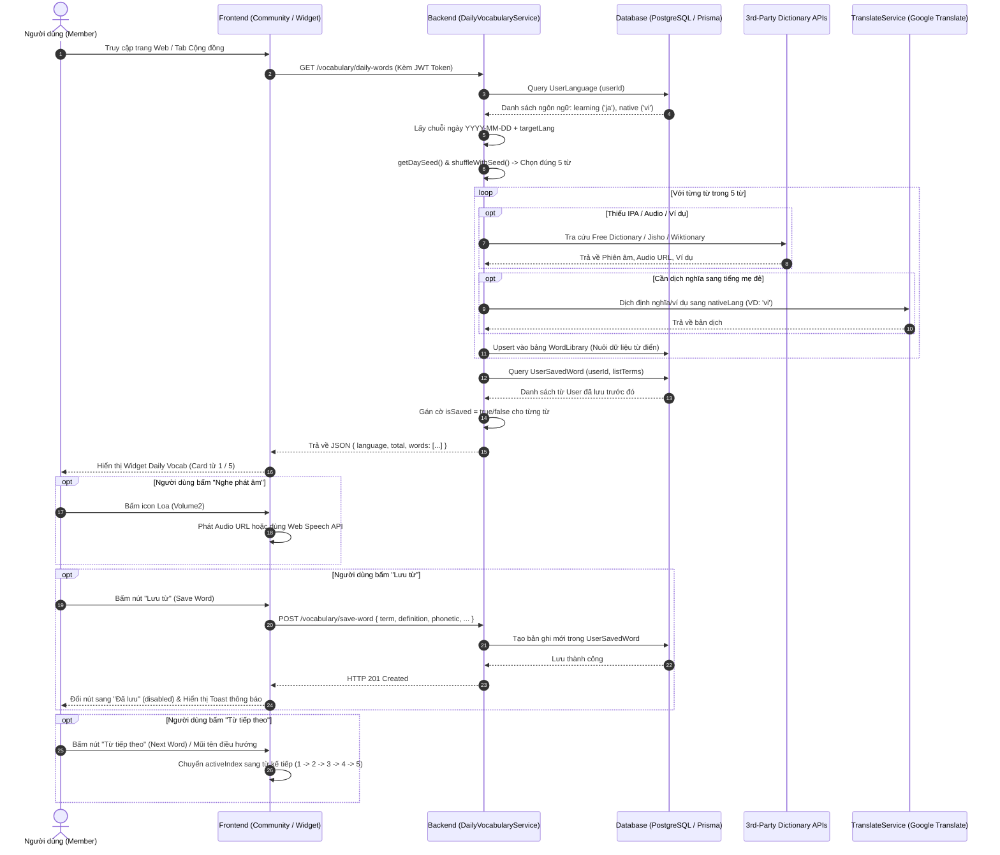

# Tài liệu Chi tiết Workflow Tính năng Daily Vocabulary (Từ Vựng Hàng Ngày)

> **Tài liệu tham khảo kỹ thuật và quy trình hoạt động của tính năng Daily Vocabulary trên Stududu.**
>
> * **Mã chức năng liên quan:** FS-23 (Sổ từ vựng cá nhân & tra cứu) & FS-24 (Nuôi dữ liệu từ điển tự động).
> * **Mục đích:** Hướng dẫn chi tiết luồng dữ liệu (Data Flow), thuật toán xoay vòng từ theo ngày (Day Seed Shuffling), cơ chế tra cứu 3rd-party APIs, dịch nghĩa tự động và tương tác giao diện người dùng.

---

## 1. Tổng quan tính năng (Overview)

Tính năng **Từ vựng mới hôm nay (Daily Vocabulary)** là một widget học tập cốt lõi được tích hợp trên giao diện Stududu (đặc biệt là Cột phải — Right Rail của trang Cộng đồng và mục Học từ vựng).

### Mục tiêu chính:
1. **Gợi ý chuẩn xác theo người học:** Tự động phát hiện ngôn ngữ mục tiêu (`role = 'learning'`) và tiếng mẹ đẻ (`role = 'native'`) của người dùng để chọn từ và ngôn ngữ dịch giải thích phù hợp.
2. **Cố định theo ngày (Daily Rotating):** Mỗi ngày cung cấp một bộ **5 từ vựng mới** cố định trong suốt 24h của ngày đó, sang ngày mới hệ thống tự động đổi sang bộ từ khác.
3. **Đầy đủ dữ liệu học tập:** Mỗi từ vựng có đầy đủ: Từ gốc (`term`), Loại từ (`partOfSpeech`), Phiên âm chuẩn (`phonetic`), Định nghĩa tiếng mẹ đẻ (`definition`), Câu ví dụ ngữ cảnh (`example`) và Giọng đọc phát âm chuẩn (`audioUrl`).
4. **Tương tác trực tiếp:** Cho phép người dùng nghe phát âm trực tiếp, chuyển qua lại giữa các từ và nhấn **"Lưu từ"** để đưa ngay vào Sổ từ vựng cá nhân (`UserSavedWord`).

---

## 2. Sơ đồ luồng hoạt động (Workflow & Sequence Diagram)



---

## 3. Phân tích chi tiết từng bước trong Workflow

### Bước 1: Tiếp nhận yêu cầu & Xác định ngôn ngữ (Language Resolution)
* **API Endpoint:** `GET /vocabulary/daily-words?target={targetCode}&native={nativeCode}`
* **Xử lý tại Backend ([`daily-vocabulary.service.ts`](file:///c:/Stududu-web/stududu-main/backend/src/modules/vocabulary/services/daily-vocabulary.service.ts)):**
  1. Trích xuất `userId` từ token xác thực JWT payload.
  2. Truy vấn bảng `UserLanguage` để tìm:
     * **Ngôn ngữ học (`role = 'learning'`):** Ưu tiên ngôn ngữ học đầu tiên của người dùng nếu query `target` không truyền (fallback: `en`).
     * **Tiếng mẹ đẻ (`role = 'native'` hoặc `role = 'fluent'`):** Dùng để dịch nghĩa giải thích (fallback: `vi`).
  3. Xử lý trường hợp đặc biệt: Nếu `targetLang === nativeLang` (ví dụ: người dùng chọn học tiếng Việt và tiếng mẹ đẻ cũng là tiếng Việt), hệ thống tự động đổi `nativeLang` sang `en` để việc giải nghĩa có ý nghĩa học tập.

---

### Bước 2: Thuật toán xoay vòng từ vựng theo ngày (Day Seed Shuffling)
* Để đảm bảo không dùng logic ngẫu nhiên thuần túy (gây đổi từ liên tục mỗi lần F5 trang), hệ thống sử dụng thuật toán **Pseudo-random có hạt giống (Seed)**:
  * **Day Seed:** Được tạo từ chuỗi ngày `YYYY-MM-DD` kết hợp với mã ngôn ngữ `targetLang` (hàm `getDaySeed`).
  * **Xáo trộn:** Hàm `shuffleWithSeed(candidates, seed)` đảm bảo tất cả người dùng học cùng một ngôn ngữ trong cùng một ngày sẽ nhận được **đúng 1 danh sách 5 từ thống nhất**.
  * Khi bước sang 00:00 ngày mới, giá trị `todayStr` đổi -> seed mới -> 5 từ vựng mới được chọn tự động.

---

### Bước 3: Thu thập nguồn từ & Làm giàu dữ liệu (Data Sourcing & Multi-tier Lookup)
Hệ thống kết hợp 3 nguồn từ vựng để tạo danh sách ứng viên (candidates):
1. **Curated Words Pool:** Kho từ vựng tinh tuyển chọn lọc sẵn cho 8 ngôn ngữ (`en`, `ja`, `ko`, `zh`, `fr`, `de`, `es`, `vi`) trong [`curated-words.data.ts`](file:///c:/Stududu-web/stududu-main/backend/src/modules/vocabulary/data/curated-words.data.ts).
2. **Datamuse API:** Lấy thêm từ vựng tiếng Anh theo chủ đề nếu `targetLang = 'en'`.
3. **WordLibrary DB:** Lấy các từ vựng đã có trong cơ sở dữ liệu PostgreSQL.

**Cơ chế tra cứu từ điển đa tầng ([`dictionary.service.ts`](file:///c:/Stududu-web/stududu-main/backend/src/modules/vocabulary/dictionary.service.ts)):**
* **Free Dictionary API (`api.dictionaryapi.dev`):** Tra cứu từ điển tiếng Anh và ngôn ngữ Châu Âu, lấy audio mp3 và phiên âm IPA.
* **Jisho API (`jisho.org`):** Tra cứu tiếng Nhật, bóc tách Kanji và phiên âm Furigana/Kana.
* **Wiktionary Open API:** Tra cứu định nghĩa mở từ Wikimedia cho tất cả các ngôn ngữ còn lại.

---

### Bước 4: Tự động dịch nghĩa sang tiếng mẹ đẻ (Auto-Translation)
* **Service phụ trách:** [`translate.service.ts`](file:///c:/Stududu-web/stududu-main/backend/src/modules/translate/translate.service.ts).
* Nếu từ lấy từ API nước ngoài (chỉ có định nghĩa tiếng Anh/Wiktionary), hệ thống tự động dịch phần định nghĩa và câu ví dụ sang `nativeLang` của người dùng (`vi` hoặc ngôn ngữ tương ứng).
* Đối với các từ thuộc kho Tinh tuyển (`CURATED_WORDS`) đã có nghĩa tiếng Việt chuẩn, hệ thống giữ nguyên nội dung nguyên bản để đảm bảo chất lượng ngữ nghĩa cao nhất.

---

### Bước 5: Tự động nuôi dữ liệu CSDL (Database Auto-Upsert)
* Mỗi từ trong batch sau khi tra cứu và làm giàu thành công sẽ được gọi hàm `prisma.wordLibrary.upsert`:
  * Khóa duy nhất: `@@unique([term, languageId])`.
  * Lưu trữ: `term`, `languageId`, `phonetic`, `partOfSpeech`, `definition`, `example`, `audioUrl`.
* Nhờ cơ chế này, kho từ điển của hệ thống liên tục được mở rộng một cách tự động theo thời gian mà không cần nạp thủ công.

---

### Bước 6: Kiểm tra trạng thái đã lưu của User
* Backend thực hiện truy vấn:
  ```typescript
  const userSaved = await prisma.userSavedWord.findMany({
    where: {
      userId,
      word: { term: { in: selectedTerms, mode: 'insensitive' } },
    },
    include: { word: true },
  });
  ```
* Tạo `Set` chứa các từ đã lưu để gán cờ `isSaved: true` hoặc `false` cho từng từ trả về cho Frontend.

---

### Bước 7: Hiển thị & Tương tác phía Frontend (UI & User Interaction)
Giao diện hiển thị dạng Card Widget hiện đại với các chức năng:
* **Hiển thị thông tin trực quan:**
  * Thẻ Badge ngôn ngữ (VD: `JA`, `EN`, `FR`) và chỉ số tiến trình (VD: `1 / 5`).
  * Từ vựng (`term`), phiên âm IPA (`phonetic`), loại từ (`partOfSpeech`).
  * Định nghĩa tiếng Việt rõ ràng, câu ví dụ minh họa ngữ cảnh.
* **Phát âm âm thanh (`🔊`):**
  * Ưu tiên phát file âm thanh từ điển (`audioUrl`).
  * Fallback sang Web Speech Synthesis API (`window.speechSynthesis`) với giọng đọc đúng mã ngôn ngữ của từ.
* **Nút "Lưu từ" (`💾 Lưu từ` / `✅ Đã lưu`):**
  * Khi bấm, gửi request `POST /vocabulary/save-word`.
  * Khi lưu thành công, cập nhật state local `isSaved = true`, chuyển nút sang trạng thái `Đã lưu` (disabled) và hiển thị thông báo Toast thành công.
* **Nút điều hướng (`←` / `⇆ Từ tiếp theo`):**
  * Cho phép người dùng chuyển vòng quanh 5 từ vựng trong ngày một cách mượt mà.

---

## 4. API Contract Chi tiết

### 4.1. `GET /vocabulary/daily-words`
Lấy danh sách 5 từ vựng của ngày hôm nay.

* **Authentication:** Bắt buộc (Bearer JWT Token).
* **Query Parameters:**
  * `target` *(tùy chọn)*: Mã ngôn ngữ học (VD: `en`, `ja`, `fr`, `ko`, `zh`, `de`, `es`, `vi`).
  * `native` *(tùy chọn)*: Mã tiếng mẹ đẻ để dịch nghĩa (mặc định: `vi`).

#### Response mẫu (200 OK):
```json
{
  "language": {
    "code": "ja",
    "name": "Japanese"
  },
  "nativeLanguage": "vi",
  "learningLanguages": [
    { "code": "ja", "name": "Japanese" }
  ],
  "total": 5,
  "words": [
    {
      "index": 1,
      "term": "桜吹雪",
      "partOfSpeech": "JA danh từ",
      "phonetic": "/sa.ku.ra.fu.bu.ki/",
      "definition": "Mưa hoa anh đào bay trong gió",
      "example": "« 風が吹くと美しい桜吹雪が舞った。 »",
      "audioUrl": "https://api.dictionary.dev/media/sakura.mp3",
      "isSaved": false,
      "languageId": 4
    },
    {
      "index": 2,
      "term": "一期一会",
      "partOfSpeech": "JA thành ngữ",
      "phonetic": "/i.chi.go.i.chi.e/",
      "definition": "Cuộc gặp gỡ chỉ một lần trong đời, hãy trân trọng",
      "example": "« 人との出会いは一期一会だと感じます。 »",
      "audioUrl": null,
      "isSaved": true,
      "languageId": 4
    }
  ]
}
```

---

### 4.2. `POST /vocabulary/save-word`
Lưu từ vựng vào Sổ từ cá nhân của người dùng.

* **Authentication:** Bắt buộc (Bearer JWT Token).
* **Request Body:**
```json
{
  "term": "桜吹雪",
  "languageId": 4,
  "personalNote": "Từ vựng học từ Daily Vocab",
  "contextSentence": "風が吹くと美しい桜吹雪が舞った。"
}
```
* **Response (201 Created):** Trả về đối tượng `UserSavedWord` đã được tạo thành công trong CSDL.

---

## 5. Danh mục các Module & File Mã Nguồn Liên Quan

| Phân hệ | Đường dẫn File | Chức năng chính |
|---|---|---|
| **Backend Controller** | [`vocabulary.controller.ts`](file:///c:/Stududu-web/stududu-main/backend/src/modules/vocabulary/vocabulary.controller.ts) | Định nghĩa route `GET /vocabulary/daily-words`, `POST /vocabulary/save-word` |
| **Backend Daily Service** | [`daily-vocabulary.service.ts`](file:///c:/Stududu-web/stududu-main/backend/src/modules/vocabulary/services/daily-vocabulary.service.ts) | Core logic: tính Day Seed, phối hợp Dictionary + Translate và query DB |
| **Backend User Vocab** | [`user-vocabulary.service.ts`](file:///c:/Stududu-web/stududu-main/backend/src/modules/vocabulary/services/user-vocabulary.service.ts) | Xử lý lưu từ vào sổ cá nhân `UserSavedWord`, cập nhật trạng thái ôn tập |
| **Backend Dictionary** | [`dictionary.service.ts`](file:///c:/Stududu-web/stududu-main/backend/src/modules/vocabulary/dictionary.service.ts) | Tích hợp các 3rd-party APIs: Free Dictionary, Datamuse, Jisho, Wiktionary |
| **Backend Curated Data** | [`curated-words.data.ts`](file:///c:/Stududu-web/stududu-main/backend/src/modules/vocabulary/data/curated-words.data.ts) | Bộ dữ liệu từ vựng tinh tuyển chuẩn cho 8 ngôn ngữ |
| **Backend Random Util** | [`random.util.ts`](file:///c:/Stududu-web/stududu-main/backend/src/modules/vocabulary/utils/random.util.ts) | Hàm `getDaySeed` và `shuffleWithSeed` xáo trộn từ theo ngày |
| **Database Schema** | [`schema.prisma`](file:///c:/Stududu-web/stududu-main/backend/prisma/schema.prisma) | Định nghĩa các bảng `WordLibrary`, `UserSavedWord`, `Language`, `UserLanguage` |
| **Frontend Community** | [`community/page.tsx`](file:///c:/Stududu-web/stududu-main/frontend/src/app/[locale]/(main)/community/page.tsx) | Widget hiển thị từ vựng hàng ngày trên thanh bên phải (Right Rail) |
