# Tài Liệu Kỹ Thuật Chi Tiết: Workflow Bôi Đen Tra Từ & Dịch Nhanh (Quick Translate & Vocabulary Lookup)

> **Tài liệu tham khảo kỹ thuật và quy trình hoạt động của tính năng Bôi đen tra từ trên Stududu.**
>
> * **Mã chức năng liên quan:** FS-23 (Sổ từ vựng cá nhân & tra cứu nhanh) & FS-24 (Thư viện từ vựng & nuôi dữ liệu tự động).
> * **Đường dẫn tài liệu:** `docs/02-design/quick-translate-workflow.md`
> * **Mục đích:** Hướng dẫn toàn diện luồng dữ liệu (Data Flow), thuật toán bắt sự kiện con trỏ chuột, tính toán vị trí hiển thị thông minh (Smart Positioning), cơ chế tra cứu từ điển & dịch thuật đa tầng (Multi-tier Translation & Dictionary Fallback), phát âm giọng bản địa và tích hợp lưu vào Sổ từ vựng.

---

## 1. Tổng Quan Tính Năng (Overview)

Tính năng **Bôi đen tra từ nhanh (Quick Text Selection Translate & Lookup)** là một công cụ hỗ trợ học tập trực tiếp (in-context learning) mạnh mẽ trên Stududu, giúp người dùng không bị gián đoạn trải nghiệm khi đang chat 1:1, đọc bài viết chia sẻ trên Community hay xem thông tin bạn học ở Discover.

```
       [ Người dùng bôi đen từ trong văn bản / tin nhắn ]
                                │
                                ▼
    ┌────────────────────────────────────────────────────────┐
    │  Popup tra từ hiển thị tức thì tại vị trí con trỏ       │
    │  ├─ 1. Từ gốc + Phiên âm IPA chuẩn + Loa phát âm       │
    │  ├─ 2. Định nghĩa dịch chuẩn sang tiếng mẹ đẻ (Tiếng Việt)│
    │  └─ 3. Câu ví dụ minh họa chuẩn ngôn ngữ học gốc       │
    └────────────────────────────────────────────────────────┘
                                │
                 [ Bấm "Lưu vào Sổ từ vựng" ]
                                ▼
         [ Đưa vào Sổ từ cá nhân & Kho dữ liệu chung ]
```

### Các mục tiêu cốt lõi:
1. **Tra cứu tức thì không chuyển trang:** Người dùng bôi đen bất kỳ từ/cụm từ nào trên giao diện là popup xuất hiện ngay lập tức tại vị trí chuột.
2. **Tự động nhận diện ngôn ngữ nguồn (Auto-detect):** Hỗ trợ đa ngôn ngữ (Anh, Pháp, Đức, Tây Ban Nha, Nhật, Hàn, Trung, Việt...).
3. **Chuẩn hóa 3 trường thông tin học tập:**
   - **Từ gốc & Phiên âm IPA & Âm thanh phát âm:** Nghe giọng đọc bản địa (Audio MP3 từ điển hoặc Web Speech Synthesis).
   - **Định nghĩa (Definition):** Được dịch sang tiếng mẹ đẻ của người dùng (`nativeLang`).
   - **Ví dụ ngữ cảnh (Example):** Giữ nguyên ngôn ngữ học gốc (`targetLang`) để người dùng hiểu đúng ngữ cảnh áp dụng.
4. **Lưu nhanh 1-Click vào Sổ từ vựng:** Đồng bộ ngay vào `UserSavedWord` và cập nhật thư viện `WordLibrary` phục vụ cho Flashcard / Quiz trắc nghiệm.

---

## 2. Sơ Đồ Quy Trình Hoạt Động (Sequence & Architecture Diagram)

```mermaid
sequenceDiagram
    autonumber
    actor User as Người dùng (Browser)
    participant FE as Frontend (TextSelectionPopup)
    participant Ctrl as VocabularyController (NestJS)
    participant LibServ as LibraryVocabularyService
    participant TransServ as TranslateService (Google/MyMemory)
    participant DictServ as DictionaryService (FreeDict API)
    participant DB as Database (PostgreSQL / Prisma)

    %% Giai đoạn 1: Bắt sự kiện người dùng
    User->>FE: Bôi đen một từ/cụm từ (mouseup)
    FE->>FE: Bỏ qua nếu text < 1 hoặc > 100 ký tự / nằm trong <input>, <textarea>
    FE->>FE: Tính toán toạ độ getBoundingClientRect() (above / below)
    
    %% Giai đoạn 2: Gửi yêu cầu Backend
    FE->>Ctrl: GET /vocabulary/lookup?term={text}&target={nativeLang}
    Ctrl->>LibServ: lookup(term, target)

    %% Giai đoạn 3: Dịch thuật & Nhận diện ngôn ngữ
    LibServ->>TransServ: translate({ text: term, target: nativeLang, source: 'auto' })
    TransServ-->>LibServ: Trả về translation & detectedLang (ví dụ: 'fr', 'ja', 'en')

    %% Giai đoạn 4: Map Language & Tra từ điển
    LibServ->>DB: Tìm Language ID theo mã detectedLang
    DB-->>LibServ: Trả về Language Record
    LibServ->>DictServ: lookup(term, detectedLang)
    
    alt Free Dictionary API có dữ liệu
        DictServ-->>LibServ: Trả về phonetic, partOfSpeech, definition, example, audioUrl
    else Không có trong từ điển
        DictServ-->>LibServ: Trả về null
    end

    %% Giai đoạn 5: Tra cứu Thư viện nội bộ
    LibServ->>DB: findFirst WordLibrary(term, languageId)
    DB-->>LibServ: Trả về dữ liệu cộng đồng (nếu có)

    %% Giai đoạn 6: Trả kết quả & Render UI
    LibServ-->>Ctrl: LookupResult Object đầy đủ
    Ctrl-->>FE: HTTP 200 JSON Response
    FE->>User: Hiển thị Popup tra từ tại toạ độ đã tính

    %% Giai đoạn 7: Tương tác người dùng
    opt Nghe phát âm
        User->>FE: Nhấp vào nút Loa (Volume2)
        FE->>FE: Ưu tiên phát audioUrl -> Fallback window.speechSynthesis
    end

    opt Lưu vào Sổ từ vựng
        User->>FE: Nhấp nút "Lưu từ"
        FE->>Ctrl: POST /vocabulary/save-word { term, definition, phonetic, example, languageId }
        Ctrl->>DB: Upsert WordLibrary (tăng saveCount) & Create UserSavedWord
        DB-->>Ctrl: Kết quả lưu từ
        Ctrl-->>FE: Trả về { saved, duplicated: false }
        FE->>User: Đóng popup & Hiển thị Toast thông báo thành công
    end
```



---

## 3. Kiến Trúc Frontend (Client-side Implementation)

Component cốt lõi: `frontend/src/components/features/TextSelectionPopup.tsx`  
Được mount toàn cục tại `frontend/src/app/[locale]/(main)/layout.tsx` để hỗ trợ tra từ trên tất cả các trang nội bộ của ứng dụng.

### 3.1 Quy Trình Lắng Nghe Sự Kiện & Lọc Đầu Vào
1. **Lắng nghe sự kiện toàn cục `mouseup`**:
   - Khi người dùng nhả chuột sau khi bôi đen một chuỗi văn bản.
2. **Bộ lọc an toàn (Sanity Checks)**:
   - **Độ dài chuỗi:** Chỉ nhận văn bản từ $1 \le \text{length} \le 100$ ký tự. Bỏ qua các thao tác vô tình bôi đen toàn bộ trang hoặc click chuột không chọn chữ.
   - **Bỏ qua Form Input:** Bỏ qua nếu con trỏ đang nằm trong thẻ `<input>` hoặc `<textarea>` để không cản trở người dùng khi gõ phím.
   - **Bỏ qua Click nội bộ:** Nếu người dùng bấm vào chính bên trong Popup tra từ, không kích hoạt lại luồng đóng/mở.
3. **Cơ chế Hủy Yêu Cầu Cũ (`AbortController`)**:
   - Khi người dùng bôi đen nhanh và liên tục từ này sang từ khác, `abortRef.current?.abort()` được gọi để hủy ngay request mạng trước đó, tránh tình trạng race condition và giảm tải cho client/server.

### 3.2 Thuật Toán Tính Vị Trí Thông Minh (Smart Positioning)
Để Popup không bị che khuất hoặc tràn ra ngoài màn hình:
```typescript
const range = selection.getRangeAt(0);
const rect = range.getBoundingClientRect();

// 1. Quyết định hiển thị phía Trên (above) hay Dưới (below)
const POPUP_HEIGHT_ESTIMATE = 280;
const direction: "above" | "below" =
  rect.top > POPUP_HEIGHT_ESTIMATE + 16 ? "above" : "below";

// 2. Tính toạ độ Top
const top = direction === "above"
  ? rect.top + window.scrollY - 8
  : rect.bottom + window.scrollY + 8;

// 3. Căn chỉnh lề Trái - Phải để không bị văng ra khỏi mép màn hình
const POPUP_WIDTH = 360;
const left = Math.max(
  16,
  Math.min(
    rect.left + rect.width / 2 - POPUP_WIDTH / 2,
    window.innerWidth - POPUP_WIDTH - 16
  )
);
```

### 3.3 Cơ Chế Phát Âm Chuẩn Bản Địa (Smart Audio Fallback)
Khi người dùng bấm vào nút Loa (`Volume2`):
1. **Ưu tiên 1 (Studio Quality MP3):** Kiểm tra `result.dictionary.audioUrl` hoặc `result.library.audioUrl`. Nếu có link file âm thanh từ Free Dictionary API, khởi tạo `new Audio(audioUrl).play()`.
2. **Ưu tiên 2 (Browser Native TTS):** Nếu không có file MP3, gọi hàm `speakWord(text, detectedLang)` sử dụng **Web Speech Synthesis API** (`window.speechSynthesis`), tự động chọn giọng đọc theo đúng mã vùng ngôn ngữ:
   - Tiếng Anh: `en-US`
   - Tiếng Pháp: `fr-FR`
   - Tiếng Nhật: `ja-JP`
   - Tiếng Trung: `zh-CN`
   - Tiếng Hàn: `ko-KR`
   - Tiếng Tây Ban Nha: `es-ES`
   - Tiếng Đức: `de-DE`
   - Tiếng Việt: `vi-VN`

---

## 4. Kiến Trúc Backend (Server-side Implementation)

Endpoints và Services liên quan:
- `backend/src/modules/vocabulary/vocabulary.controller.ts`
- `backend/src/modules/vocabulary/services/library-vocabulary.service.ts`
- `backend/src/modules/translate/translate.service.ts`
- `backend/src/modules/vocabulary/dictionary.service.ts`

### 4.1 Quy Trình Xử Lý API `GET /vocabulary/lookup`

| Bước | Thực thi | Chi tiết hành động |
| :--- | :--- | :--- |
| **B1** | Chuẩn hóa chuỗi | `term.trim()` và kiểm tra chuỗi rỗng. |
| **B2** | Nhận diện & Dịch thuật | Gọi `TranslateService.translate()` với `source: 'auto'` và `target: nativeLang`. Lấy được nghĩa dịch tức thời và mã ngôn ngữ nguồn (`detectedLang`). |
| **B3** | Phân giải Ngôn ngữ | Tra mã `detectedLang` trong bảng `Language` của CSDL PostgreSQL để lấy `languageId`. Fallback về `en` nếu không tìm thấy. |
| **B4** | Tra cứu Từ điển Quốc tế | Gọi `DictionaryService.lookup(term, detectedLang)` trích xuất phiên âm IPA chuẩn, từ loại (`partOfSpeech`), câu ví dụ gốc (`example`) và file audio phát âm (`audioUrl`). |
| **B5** | Tra cứu Thư viện Nội bộ | Truy vấn bảng `WordLibrary` xem từ đã từng được cộng đồng đóng góp hay chỉnh sửa thông tin chuẩn chưa. |
| **B6** | Hợp nhất & Phản hồi | Gói đối tượng `LookupResult` trả về cho Frontend với cấu trúc đồng nhất. |

### 4.2 Cấu Trúc Dữ Liệu Trả Về (Data Contract)

```json
{
  "term": "bonjour",
  "translation": "xin chào",
  "detectedLang": "fr",
  "languageId": 6,
  "phonetic": "/bɔ̃.ʒuʁ/",
  "dictionary": {
    "phonetic": "/bɔ̃.ʒuʁ/",
    "partOfSpeech": "noun",
    "definition": "Lời chào buổi sáng hoặc ban ngày trong tiếng Pháp.",
    "example": "Bonjour tout le monde, comment allez-vous aujourd'hui?",
    "audioUrl": "https://api.dictionaryapi.dev/media/pronunciations/fr/bonjour.mp3"
  },
  "library": {
    "id": 142,
    "phonetic": "/bɔ̃.ʒuʁ/",
    "partOfSpeech": "noun",
    "definition": "xin chào",
    "example": "Bonjour tout le monde!",
    "languageId": 6,
    "languageName": "French",
    "saveCount": 15
  }
}
```

---

## 5. Các Dịch Vụ Bên Ngoài & Cơ Chế Dự Phòng (Fallback Mechanism)

Hệ thống được thiết kế với độ chịu lỗi cao (High Availability), không bao giờ để việc một dịch vụ bên thứ 3 gián đoạn làm treo trải nghiệm người dùng:

```
[ Dịch Nghĩa / Nhận Diện Ngôn Ngữ ]
 ├── Ưu tiên 1: Google Translate API v2 (nếu có GOOGLE_TRANSLATE_API_KEY)
 ├── Ưu tiên 2: Google Translate GTX Endpoint (Free Auto-detect)
 └── Ưu tiên 3: MyMemory Translation API (Backup Gateway)

[ Từ Điển & Câu Ví Dụ ]
 ├── Ưu tiên 1: Free Dictionary API (https://api.dictionaryapi.dev)
 ├── Ưu tiên 2: Thư viện từ nội bộ WordLibrary (Dữ liệu đã có trong DB)
 └── Ưu tiên 3: Mẫu câu ngữ cảnh Fallback tạo tự động theo ngôn ngữ gốc

[ Phát Âm (Audio Playback) ]
 ├── Ưu tiên 1: File Audio MP3 chính thống từ Dictionary API / WordLibrary
 └── Ưu tiên 2: Trình tổng hợp giọng nói Web Speech Synthesis API trên trình duyệt
```

---

## 6. Luồng Tích Hợp Sổ Từ Vựng & Ôn Tập (Vocabulary Integration)

Sau khi từ vựng được tra cứu thông qua Popup bôi đen:
1. **Lưu từ (`POST /vocabulary/save-word`)**:
   - Tạo bản ghi trong `UserSavedWord` gắn với `userId`.
   - Cập nhật bản ghi trong `WordLibrary` (nếu có $3$ người dùng khác nhau cùng lưu, từ vựng tự động được cấp cờ `isPublic = true` theo quy tắc BR-12).
2. **Đồng bộ Ôn tập trắc nghiệm (Vocabulary Quiz)**:
   - Từ vừa lưu sẽ xuất hiện trong danh sách từ cần học tại trang `/vocabulary`.
   - Tham gia vào thuật toán tạo câu hỏi Quiz với cơ chế loại bỏ đáp án nhiễu (Distractors) đa tầng, đảm bảo đáp án trắc nghiệm luôn đồng bộ ngôn ngữ và không bị trùng lặp.

---

## 7. Xử Lý Các Trường Hợp Ngoại Lệ (Edge Cases & Error Handling)

| Tình huống | Cách hệ thống xử lý |
| :--- | :--- |
| **Bôi đen quá dài (>100 ký tự)** | Bỏ qua, không bật popup để tránh tra cứu nhầm toàn bộ đoạn văn. |
| **Bôi đen trong ô nhập tin nhắn** | Bỏ qua nếu `activeElement` là `<input>` hoặc `<textarea>`, bảo toàn thao tác nhập liệu của người dùng. |
| **Bôi đen liên tục nhiều từ** | `AbortController` tự động hủy request đang chờ của từ trước đó, chỉ hiển thị kết quả của từ cuối cùng. |
| **Mất mạng / API từ điển lỗi** | Trả về nghĩa dịch thô từ Google GTX và phát âm bằng giọng đọc `speechSynthesis` cục bộ của trình duyệt. |
| **Từ đã tồn tại trong Sổ từ** | Backend trả về cờ `duplicated: true`, Frontend hiển thị thông báo Toast "Từ này đã có trong sổ từ của bạn" mà không báo lỗi. |

---
*Tài liệu được cập nhật vào kho tài liệu kỹ thuật chuẩn của dự án Stududu (`docs/02-design/`).*
