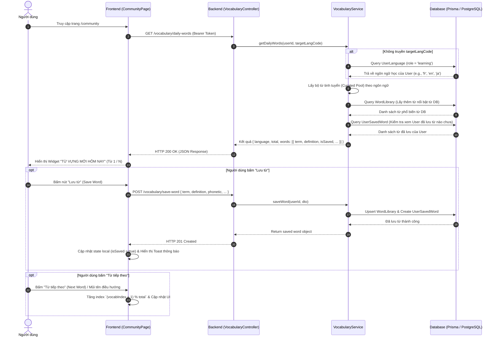

# Tài liệu Thiết kế & Triển khai Tính năng Daily Vocabulary (Từ Vựng Mới Hôm Nay)

Tài liệu này giải thích chi tiết về kiến trúc, luồng xử lý (workflow), logic backend, frontend và API contract của tính năng **"Từ vựng mới hôm nay" (Daily Vocabulary)** trên trang Cộng đồng của **Stududu**.

---

## 1. Tổng quan (Overview)

Tính năng **Từ vựng mới hôm nay** được thiết kế dưới dạng widget tương tác trên cột bên phải (Right Rail) của trang Cộng đồng. 

### Mục tiêu chính:
- Tự động gợi ý từ vựng mới thuộc **ngôn ngữ mà người dùng đang chọn học** (Language Learning Role).
- Cung cấp thông tin chi tiết: Từ (term), Loại từ (part of speech), Phiên âm chuẩn IPA (phonetic), Định nghĩa/Nghĩa tiếng Việt (definition), và Câu ví dụ minh họa thực tế (example sentence).
- Tích hợp 2 hành động tương tác chính:
  1. **Lưu từ (Save Word)**: Lưu từ vựng trực tiếp vào **Sổ từ vựng cá nhân** của người dùng.
  2. **Từ tiếp theo / Đã biết (Next / Skip)**: Chuyển sang từ tiếp theo trong danh sách từ vựng trong ngày.

---

## 2. Kiến trúc & Sơ đồ Luồng (Workflow Architecture)



---

## 3. Chi tiết triển khai Backend (Backend Implementation)

### 3.1. Controller Layer
**File:** [vocabulary.controller.ts](file:///c:/Stududu-web/stududu-main/backend/src/modules/vocabulary/vocabulary.controller.ts)

Thêm endpoint mới với bảo vệ `JwtAuthGuard`:
```typescript
@Get('daily-words')
@UseGuards(JwtAuthGuard)
getDailyWords(@CurrentUser() user: JwtPayload, @Query('target') target?: string) {
  return this.vocabularyService.getDailyWords(user.sub, target);
}
```

### 3.2. Service Layer & Logic Xử lý
**File:** [vocabulary.service.ts](file:///c:/Stududu-web/stududu-main/backend/src/modules/vocabulary/vocabulary.service.ts)

Hàm `getDailyWords(userId?: number, targetCode?: string)` thực hiện 4 bước:

1. **Xác định Ngôn ngữ Mục tiêu (Target Language Resolution)**:
   - Ưu tiên 1: Lấy từ `targetCode` do client truyền lên (nếu có).
   - Ưu tiên 2: Truy vấn bảng `UserLanguage` để lấy `language.code` mà người dùng khai báo `role = 'learning'`.
   - Fallback: Mặc định là `'en'` (Tiếng Anh) nếu người dùng chưa khai báo ngôn ngữ học.

2. **Khởi tạo Nguồn Từ Vựng Tinh Tuyển (Curated Dictionary Pool)**:
   Hệ thống duy trì bộ từ vựng mẫu chất lượng cao cho các ngôn ngữ chính (`en`, `fr`, `ja`, `ko`, `zh`, `es`, `de`). Mỗi từ gồm:
   - `term`: Từ vựng gốc (e.g. *résilience*, *serendipity*, *木漏れ日*).
   - `partOfSpeech`: Loại từ & Mã ngôn ngữ (e.g. *FR danh từ*, *EN noun*, *JA danh từ*).
   - `phonetic`: Phiên âm chuẩn IPA (e.g. */re.zi.ljɑ̃s/*).
   - `definition`: Giải nghĩa tiếng Việt ngắn gọn, dễ hiểu.
   - `example`: Câu ví dụ ngữ cảnh chuẩn bản xứ.

3. **Kết hợp Từ vựng từ Thư viện Cộng đồng (Database Word Library)**:
   - Truy vấn 10 từ có `saveCount` cao nhất trong bảng `WordLibrary` matching với `languageId`.
   - Ghép thêm vào danh sách từ daily nếu từ đó chưa tồn tại trong bộ tinh tuyển.

4. **Kiểm tra Trạng thái Đã Lưu (User Saved Status Check)**:
   - Truy vấn toàn bộ từ trong `UserSavedWord` của `userId`.
   - So khớp và trả về thuộc tính `isSaved: true/false` cho từng từ.

---

## 4. Chi tiết triển khai Frontend (Frontend Implementation)

**File:** [page.tsx](file:///c:/Stududu-web/stududu-main/frontend/src/app/[locale]/(main)/community/page.tsx)

### 4.1. Quản lý State
- `dailyWordsData`: Lưu object response từ API (`DailyWordsResponse`).
- `vocabIndex`: Chỉ số từ vựng hiện tại đang hiển thị (0-based index).
- `savingVocab`: Trạng thái loading khi đang gửi request lưu từ.

### 4.2. Giao diện Card Widget
Widget được đặt ở Cột phải (Right Rail) với thiết kế gradient nhẹ nhàng, nổi bật:
- **Header**: Tiêu đề `📖 TỪ VỰNG MỚI HÔM NAY` kèm chỉ số tiến trình (e.g. `1 / 12`).
- **Nội dung từ vựng**:
  - `term`: Chữ in đậm nổi bật với font thương hiệu (`font-display text-2xl`).
  - `partOfSpeech` & `phonetic`: Chữ nhỏ màu tím nổi bật (`text-secondary font-semibold`).
  - `definition`: Nghĩa tiếng Việt rõ ràng (`text-sm font-semibold text-foreground/90`).
  - `example`: Câu ví dụ in nghiêng đặt trong khung mờ (`bg-surface/60 border border-border/50`).
- **Nút điều hướng & thao tác**:
  - Nút mũi tên trái `←`: Quay lại từ trước đó.
  - Nút **💾 Lưu từ**: Gọi API `POST /vocabulary/save-word`. Khi thành công, đổi nút thành `✅ Đã lưu` (disabled).
  - Nút **Từ tiếp theo ⇆**: Chuyển sang từ tiếp theo theo vòng lặp.

---

## 5. API Data Contract

### 5.1. GET `/vocabulary/daily-words`
**Headers:**
`Authorization: Bearer <accessToken>`

**Query Parameters:**
- `target` *(optional)*: Mã ngôn ngữ (e.g. `en`, `fr`, `ja`).

**Sample Response Body (200 OK):**
```json
{
  "language": {
    "code": "fr",
    "name": "Français"
  },
  "total": 6,
  "words": [
    {
      "index": 1,
      "term": "résilience",
      "partOfSpeech": "FR danh từ",
      "phonetic": "/re.zi.ljɑ̃s/",
      "definition": "Sự kiên cường, khả năng phục hồi",
      "example": "« Sa résilience face aux difficultés est admirable. »",
      "isSaved": false,
      "languageId": 6
    },
    {
      "index": 2,
      "term": "flâner",
      "partOfSpeech": "FR động từ",
      "phonetic": "/fla.ne/",
      "definition": "Đi dạo thong dong, thưởng ngoạn phố phường",
      "example": "« J’aime flâner dans les rues de Paris. »",
      "isSaved": true,
      "languageId": 6
    }
  ]
}
```

---

## 6. Khả năng Mở rộng trong Tương lai (Future Enhancements)

1. **Phát âm Audio (Text-to-Speech)**:
   - Tích hợp Web Speech API hoặc Google TTS để thêm nút phát âm âm thanh giọng đọc chuẩn khi bấm vào biểu tượng loa.
2. **Thuật toán Lặp lại Ngắt quãng (Spaced Repetition - SRS)**:
   - Lưu vết lịch sử các từ người dùng đã chọn "Đã biết" để giảm tần suất xuất hiện và tăng tần suất các từ chưa biết.
3. **Thống kê Chuỗi Học (Vocabulary Streak)**:
   - Ghi nhận mốc điểm thưởng khi người dùng tương tác đủ N từ vựng mới mỗi ngày.
