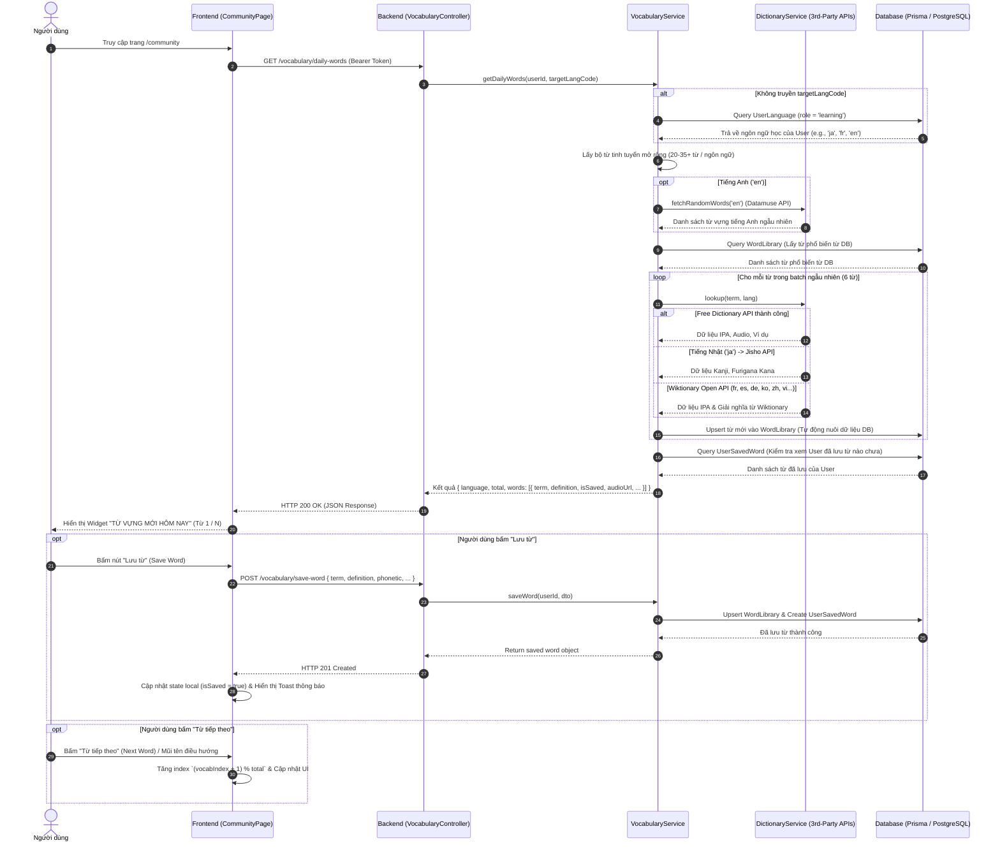

# Tài liệu Thiết kế & Triển khai Tính năng Daily Vocabulary (Từ Vựng Mới Hôm Nay)

Tài liệu này giải thích chi tiết về kiến trúc, luồng xử lý (workflow), logic backend, frontend và API contract của tính năng **"Từ vựng mới hôm nay" (Daily Vocabulary)** trên trang Cộng đồng của **Stududu**.

---

## 1. Tổng quan (Overview)

Tính năng **Từ vựng mới hôm nay** được thiết kế dưới dạng widget tương tác trên cột bên phải (Right Rail) của trang Cộng đồng. 

### Mục tiêu chính:
- Tự động gợi ý từ vựng mới thuộc **ngôn ngữ mà người dùng đang chọn học** (Language Learning Role).
- Cung cấp thông tin chi tiết: Từ (term), Loại từ (part of speech), Phiên âm chuẩn IPA (phonetic), Định nghĩa/Nghĩa tiếng Việt (definition), và Câu ví dụ minh họa thực tế (example sentence).
- Tích hợp 2 hành động tương tác chính:
  1. **Lưu từ (Save Word)**: Lưu từ vựng trực tiếp vào **Sổ từ vựng cá nhân** của người dùng.
  2. **Từ tiếp theo / Đã biết (Next / Skip)**: Chuyển sang từ tiếp theo trong danh sách từ vựng trong ngày.

---

## 2. Kiến trúc & Sơ đồ Luồng (Workflow Architecture)



---

## 3. Chi tiết triển khai Backend (Backend Implementation)

### 3.1. Controller Layer
**File:** [vocabulary.controller.ts](file:///c:/Stududu-web/stududu-main/backend/src/modules/vocabulary/vocabulary.controller.ts)

Thêm endpoint mới với bảo vệ `JwtAuthGuard`:
```typescript
@Get('daily-words')
@UseGuards(JwtAuthGuard)
getDailyWords(@CurrentUser() user: JwtPayload, @Query('target') target?: string) {
  return this.vocabularyService.getDailyWords(user.sub, target);
}
```

### 3.2. Dictionary Service (Tích hợp 3rd-Party APIs)
**File:** [dictionary.service.ts](file:///c:/Stududu-web/stududu-main/backend/src/modules/vocabulary/dictionary.service.ts)

Hệ thống triển khai chuỗi tra cứu tự động đa tầng (Multi-Tier Lookup Fallback Chain):
1. **Free Dictionary API** (`api.dictionaryapi.dev`): Tra cứu từ điển tiếng Anh và ngôn ngữ Châu Âu.
2. **Datamuse API** (`api.datamuse.com`): Sinh từ vựng tiếng Anh ngẫu nhiên theo chủ đề (`fetchRandomWords`).
3. **Jisho API** (`jisho.org/api/v1`): Tra cứu từ điển tiếng Nhật, bóc tách Kanji và Furigana/Kana (`lookupJisho`).
4. **Wiktionary Open API** (`${lang}.wiktionary.org/w/api.php`): API mở từ Wikimedia cho tất cả các ngôn ngữ (`fr`, `es`, `de`, `ko`, `zh`, `vi`, `ja`).

### 3.3. Service Layer & Logic Xử lý
**File:** [vocabulary.service.ts](file:///c:/Stududu-web/stududu-main/backend/src/modules/vocabulary/vocabulary.service.ts)

Hàm `getDailyWords(userId?: number, targetCode?: string)` thực hiện:

1. **Xác định Ngôn ngữ Mục tiêu (Target Language Resolution)**:
   - Lấy `targetCode` truyền lên hoặc ngôn ngữ `role = 'learning'` của người dùng (fallback `'en'`).

2. **Bộ Từ Vựng Tinh Tuyển Mở Rộng (Expanded Curated Pools)**:
   - Hệ thống duy trì kho từ 20-35+ từ chọn lọc cho 8 ngôn ngữ chính (`en`, `fr`, `ja`, `ko`, `zh`, `es`, `de`, `vi`).

3. **Tra cứu & Tự Động Dịch (Dynamic Lookup & Auto-Translation)**:
   - Mỗi từ trong batch 6 từ được tra cứu qua `DictionaryService` để lấy IPA/Pronunciation, Audio URL.
   - Tự động dịch nghĩa câu ví dụ và định nghĩa sang ngôn ngữ mẹ đẻ của người dùng (`vi` hoặc `en`) qua `TranslateService`.

4. **Nuôi dữ liệu CSDL Tự Động (Automatic DB Upsert)**:
   - Tự động lưu/cập nhật thông tin từ điển vào bảng `WordLibrary` trong CSDL PostgreSQL khi tra cứu thành công.

---

## 4. Chi tiết triển khai Frontend (Frontend Implementation)

**File:** [page.tsx](file:///c:/Stududu-web/stududu-main/frontend/src/app/[locale]/(main)/community/page.tsx)

### 4.1. Quản lý State
- `dailyWordsData`: Lưu object response từ API (`DailyWordsResponse`).
- `vocabIndex`: Chỉ số từ vựng hiện tại đang hiển thị (0-based index).
- `savingVocab`: Trạng thái loading khi đang gửi request lưu từ.

### 4.2. Giao diện Card Widget
Widget được đặt ở Cột phải (Right Rail) với thiết kế gradient nhẹ nhàng, nổi bật:
- **Header**: Tiêu đề `📖 TỪ VỰNG MỚI HÔM NAY` kèm thẻ tag ngôn ngữ và chỉ số tiến trình (e.g. `1 / 6`).
- **Nội dung từ vựng**:
  - `term`: Chữ in đậm nổi bật với font thương hiệu (`font-display text-2xl`).
  - Nút phát âm âm thanh `🔊`: Nghe giọng đọc phát âm từ điển chuẩn.
  - `partOfSpeech` & `phonetic`: Phiên âm chuẩn IPA / Kana / Romaji (`text-secondary font-semibold`).
  - `definition`: Nghĩa tiếng Việt rõ ràng (`text-sm font-semibold text-foreground/90`).
  - `example`: Câu ví dụ in nghiêng đặt trong khung mờ (`bg-surface/60 border border-border/50`).
- **Nút điều hướng & thao tác**:
  - Nút mũi tên trái `←`: Quay lại từ trước đó.
  - Nút **💾 Lưu từ**: Gọi API `POST /vocabulary/save-word`. Khi thành công, đổi nút thành `✅ Đã lưu` (disabled).
  - Nút **Từ tiếp theo ⇆**: Chuyển sang từ tiếp theo theo vòng lặp.

---

## 5. API Data Contract

### 5.1. GET `/vocabulary/daily-words`
**Headers:**
`Authorization: Bearer <accessToken>`

**Query Parameters:**
- `target` *(optional)*: Mã ngôn ngữ (e.g. `en`, `fr`, `ja`, `ko`, `zh`).
- `native` *(optional)*: Ngôn ngữ mẹ đẻ (e.g. `vi`).

**Sample Response Body (200 OK):**
```json
{
  "language": {
    "code": "ja",
    "name": "日本語"
  },
  "nativeLanguage": "vi",
  "total": 6,
  "words": [
    {
      "index": 1,
      "term": "桜吹雪",
      "partOfSpeech": "JA danh từ",
      "phonetic": "/sa.ku.ra.fu.bu.ki/",
      "definition": "Mưa hoa anh đào bay trong gió",
      "example": "« 風が吹くと美しい桜吹雪が舞った。 »",
      "audioUrl": null,
      "isSaved": false,
      "languageId": 4
    }
  ]
}
```

---

## 6. Các Tính năng Đã Hoàn Thành & Hướng Phát Triển Tiếp Theo

1. **Đã Hoàn Thành (Done)**:
   - ✅ Phủ sóng 3rd-Party APIs từ điển cho tất cả các ngôn ngữ (`en`, `ja`, `fr`, `es`, `de`, `ko`, `zh`, `vi`).
   - ✅ Phát âm âm thanh audio phát âm chuẩn qua Free Dictionary & Web Speech API.
   - ✅ Mở rộng bộ từ tinh tuyển 20-35+ từ mỗi ngôn ngữ.
   - ✅ Tự động dịch định nghĩa & câu ví dụ sang tiếng Việt.
   - ✅ Tự động nuôi dữ liệu CSDL `WordLibrary`.

2. **Hướng Phát Triển Tiếp Theo (Next Steps)**:
   - 🔄 Tích hợp thuật toán Lặp lại Ngắt quãng (Spaced Repetition - SRS).
   - 🏆 Thống kê Chuỗi Học (Vocabulary Streak) & Thưởng điểm kinh nghiệm (XP).

