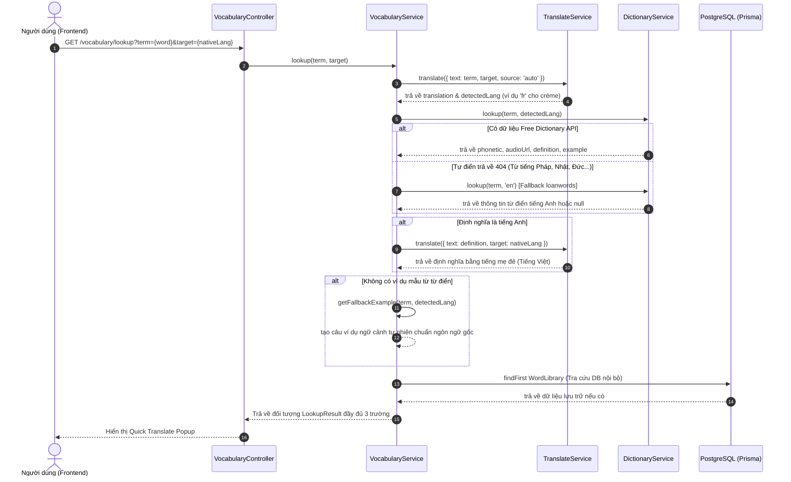

# Tài Liệu Logic & Workflow Chức Năng Bôi Đen Tra Từ & Ôn Tập Từ Vựng (Quick Translate & Vocabulary System)

Document Path: `c:\Stududu-web\stududu-main\docs\quick_translate_workflow.md`

## 1. Tổng Quan Chức Năng (Overview)

Chức năng **Bôi đen tra từ nhanh (Quick Translate Popup)** và **Quản lý Sổ từ vựng / Quiz** cho phép người dùng:
- **Bôi đen bất kỳ từ vựng nào** thuộc bất kỳ ngôn ngữ nào (Anh, Pháp, Nhật, Hàn, Đức, Tây Ban Nha, v.v.) trên ứng dụng.
- **Tự động nhận diện ngôn ngữ gốc** và hiển thị Popup tra cứu ngay tại vị trí con trỏ chuột.
- **Đảm bảo 100% hiển thị 3 trường thông tin chuẩn**:
  1. **Từ vựng gốc, Phiên âm chuẩn IPA & Nút Loa phát âm** (file MP3 từ điển hoặc Web Speech Synthesis).
  2. **Định nghĩa (Definition)** được dịch chuẩn xác sang **ngôn ngữ mẹ đẻ** (Native Language, ví dụ: Tiếng Việt).
  3. **Ví dụ minh họa (Example sentence)** được giữ nguyên bằng **ngôn ngữ học gốc** (Target Language) để người dùng hiểu đúng ngữ cảnh và cách dùng từ thực tế.
- **Lưu nhanh vào Sổ từ vựng cá nhân** và phục vụ ôn tập trắc nghiệm không lặp lại trong phần **Quiz Vocabulary**.

---

## 2. Kiến Trúc Tầng Backend (Backend Architecture & APIs)

### 2.1 Các API & Dịch Vụ Bên Ngoài Được Tích Hợp

| Dịch vụ / API | Website / Endpoint | Tác dụng trong hệ thống |
| :--- | :--- | :--- |
| **Free Dictionary API** | `https://api.dictionaryapi.dev/api/v2/entries/{lang}/{term}` | Trích xuất phiên âm IPA, file audio MP3 phát âm, các định nghĩa chuẩn từ điển và câu ví dụ minh họa thực tế. |
| **Google Translate GTX** | `https://translate.googleapis.com/translate_a/single?client=gtx` | Nhận diện ngôn ngữ nguồn tự động (`auto-detect`) và dịch thuật định nghĩa/từ vựng sang tiếng mẹ đẻ của người dùng. |
| **Google Translate API v2** | `https://translation.googleapis.com/language/translate/v2` | Tầng dịch thuật ưu tiên nếu có cấu hình `GOOGLE_TRANSLATE_API_KEY`. |
| **MyMemory Translation API** | `https://api.mymemory.translated.net/get` | Tầng dịch thuật dự phòng thứ 3 khi Google API bị gián đoạn mạng. |
| **Web Speech API** | `window.speechSynthesis` (Browser API) | Đọc phát âm giọng nói tự nhiên chuẩn từng ngôn ngữ (Pháp `fr-FR`, Anh `en-US`, Nhật `ja-JP`...) khi file audio MP3 không có sẵn. |

---

### 2.2 Quy Trình Xử Lý Backend (`GET /vocabulary/lookup`)



---

## 3. Luồng Hoạt Động Frontend (Frontend Workflow)

### 3.1 Component `TextSelectionPopup.tsx`
1. **Lắng nghe sự kiện `mouseup` toàn trang**:
   - Khi người dùng bôi đen văn bản (độ dài từ 1 - 100 ký tự), tự động bỏ qua nếu chọn trong thẻ `<input>` hoặc `<textarea>`.
2. **Tính toán vị trí hiển thị (Smart Positioning)**:
   - Xác định con trỏ chuột và kích thước cửa sổ để hiển thị Popup ở trên (`above`) hoặc ở dưới (`below`) cụm từ được chọn, tự động căn lề không bị văng ra khỏi mép màn hình.
3. **Gọi API bất đồng bộ có AbortController**:
   - Tự động hủy (`abort`) các yêu cầu cũ nếu người dùng bôi đen liên tục sang từ mới, giúp tối ưu hiệu năng.
4. **Phát âm âm thanh (`handlePlayAudio`)**:
   - Nhấp vào nút loa `Volume2`: Ưu tiên phát file audio MP3 từ Free Dictionary API; nếu không có file MP3, tự động chuyển sang `window.speechSynthesis` phát âm bằng đúng giọng đọc bản địa (`fr-FR`, `en-US`, `ja-JP`, `de-DE`...).
5. **Nút "Lưu vào Sổ từ vựng"**:
   - Gọi `POST /vocabulary/save-word` để lưu từ vào bảng `UserSavedWord` & `WordLibrary` trong DB mà không làm gián đoạn trải nghiệm người dùng.

---

### 3.2 Logic Ôn Tập Quiz Không Lặp Đánh Đáp Án (`vocabulary/page.tsx`)

1. **Bộ Lọc Đồng Bộ Ngôn Ngữ (`isMatchingLanguage`)**:
   - Nếu đề bài yêu cầu đáp án bằng Tiếng Việt, toàn bộ 4 lựa chọn trắc nghiệm A, B, C, D bắt buộc 100% phải là Tiếng Việt. Mọi đáp án chưa dịch hoặc còn nguyên tiếng Anh sẽ tự động bị loại bỏ.
2. **Cơ chế Đáp Án Nhiễu Đa Tầng**:
   - **Ưu tiên 1**: Lấy định nghĩa từ các từ khác trong Sổ tay cá nhân của người dùng.
   - **Ưu tiên 2**: Gọi API `GET /vocabulary/distractors?native={locale}&target=en` để lấy định nghĩa từ điển ngẫu nhiên từ Free Dictionary API.
   - **Ưu tiên 3**: Ngân hàng fallback distractors mở rộng (hơn 30+ mẫu định nghĩa phong phú cho từng ngôn ngữ) giúp bài kiểm tra Quiz luôn mới mẻ, tự nhiên và không bao giờ lặp lại.

---

## 4. Tóm Tắt Định Dạng Dữ Liệu Tra Cứu (Lookup Result Format)

```json
{
  "term": "crème",
  "translation": "kem",
  "detectedLang": "fr",
  "languageId": 6,
  "dictionary": {
    "phonetic": null,
    "partOfSpeech": null,
    "definition": "kem",
    "example": "Elle aime ajouter de la crème fraîche dans sa recette de gâteau.",
    "audioUrl": "https://api.dictionaryapi.dev/media/pronunciations/fr/creme.mp3"
  },
  "library": null
}
```

---
*Tài liệu được cập nhật tự động cho dự án Stududu-web.*
